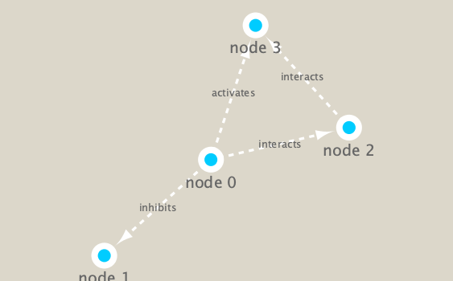

```{r setup, include=FALSE}
knitr::opts_chunk$set(echo = TRUE)
```
```{r}
library(RCy3)
```

```{r}
cytoscapePing()
cytoscapeVersionInfo()
```

```{r}
g <- makeSimpleIgraph()
createNetworkFromIgraph(g,"myGraph")
```

```{r}
setVisualStyle("Marquee")
```
## save an image from cytoscape 
```{r}
fig <- exportImage(filename="demo_marquee", type="png", height=350)


```

```{r}
## scripts for processing located in "inst/data-raw/"
prok_vir_cor <- read.delim("./virus_prok_cor_abundant.tsv", stringsAsFactors = FALSE)

## Have a peak at the first 6 rows
head(prok_vir_cor)
```

```{r}
nrow(prok_vir_cor)
```

```{r}
library(igraph)
g <- graph.data.frame(prok_vir_cor, directed = FALSE)
plot(g, vertex.label=NA)
```
```{r}
plot(g, vertex.size=3, vertex.label=NA)
```
```{r}
createNetworkFromIgraph(g,"myIgraph")
```

```{r}
cb <- cluster_edge_betweenness(g)
```

```{r}
plot(cb, y=g, vertex.label=NA,  vertex.size=3)
```

